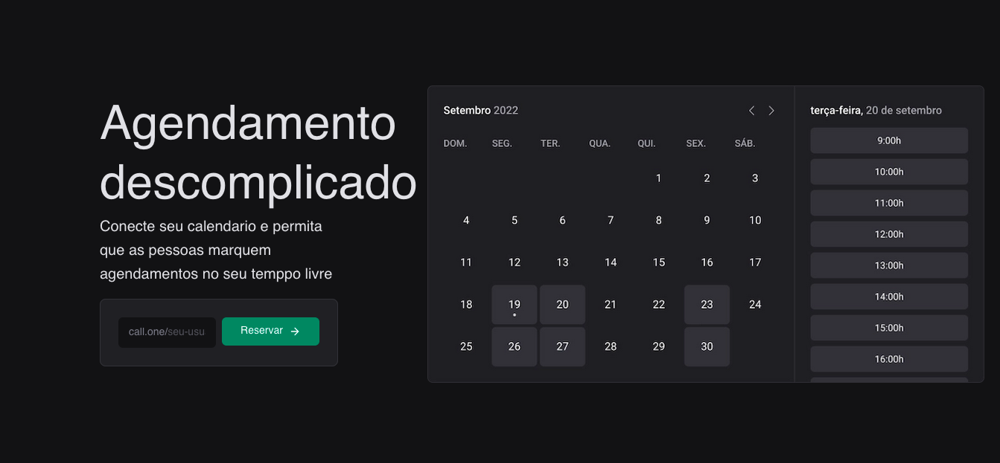
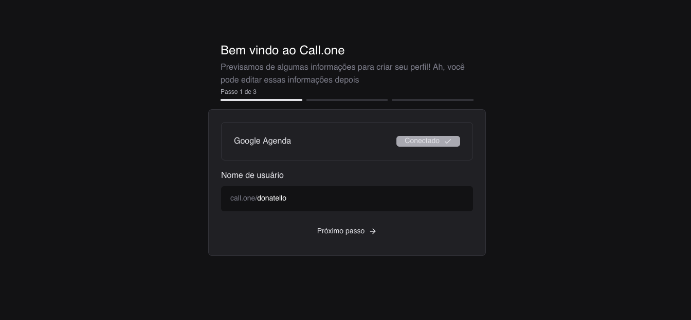
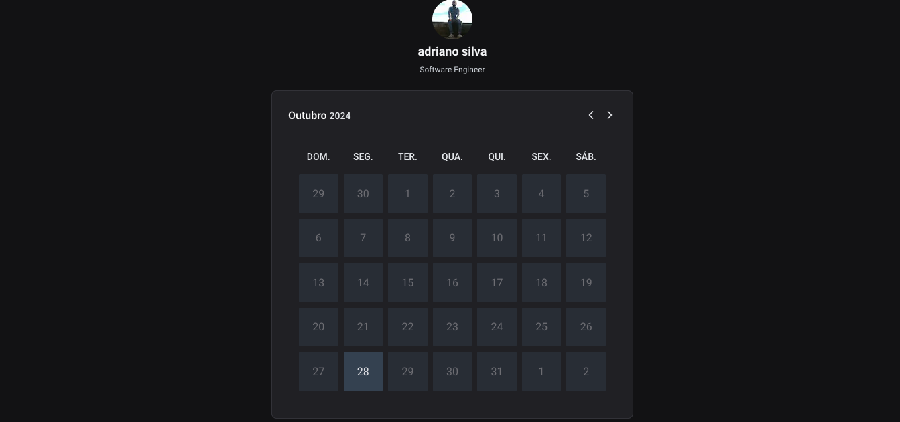

<h1 align="center">
  Call.one
</h1>
## Aplicativo para conectar seu calendario e permita que as pessoas marquem agendamentos no seu temppo livre

**Tecnologias:**

- [ReactJS](https://pt-br.reactjs.org)
- [NextJS](https://pt-br.reactjs.org)
- [Typescript](https://www.typescriptlang.org)
- [Tailwindcss](https://tailwindcss.com)-
- [React Hook Form](https://react-hook-form.com)
- [Zod](https://zod.dev)
- [Prisma](https://prisma.io)
- [DayJS](https://day.js.org)
- [Google Calendar](https://calendar.google.com/calendar)

**Demonstração:**

<p align="center">
  
  
  
</p>

**Instalação e Execução:**

1.  Clone o repositório:

Bash

```
git clone https://github.com/Gui-dev/call-one

```

2.  Execute database no docker:

Bash

```
docker run -p 5432:5432 -e POSTGRES_PASSWORD=sua_senha seu_usuario
```

3.  Execute a aplicação web:

Bash

```
npm run dev
```

4.  Acesse a aplicação em http://localhost:3000 no seu navegador.

**Contribuição:**

Agradecemos a sua contribuição para este projeto! Você pode contribuir submetendo issues e pull requests no repositório GitHub.

**Licença:**

Este projeto está licenciado sob a licença MIT.
